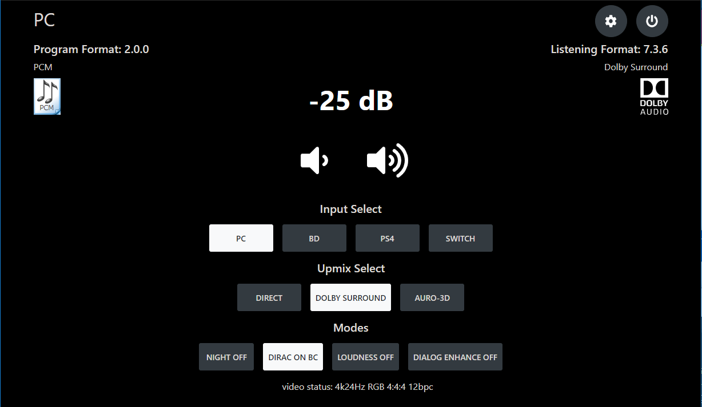
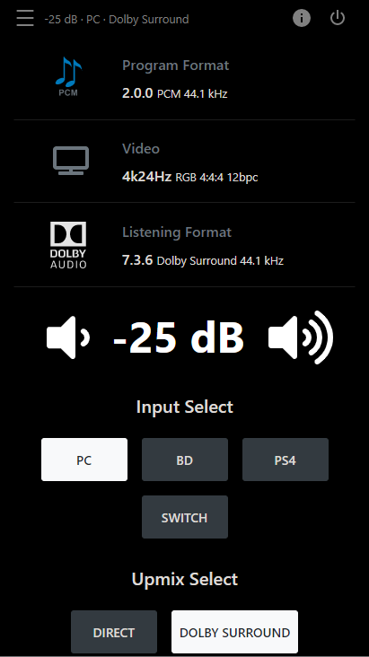
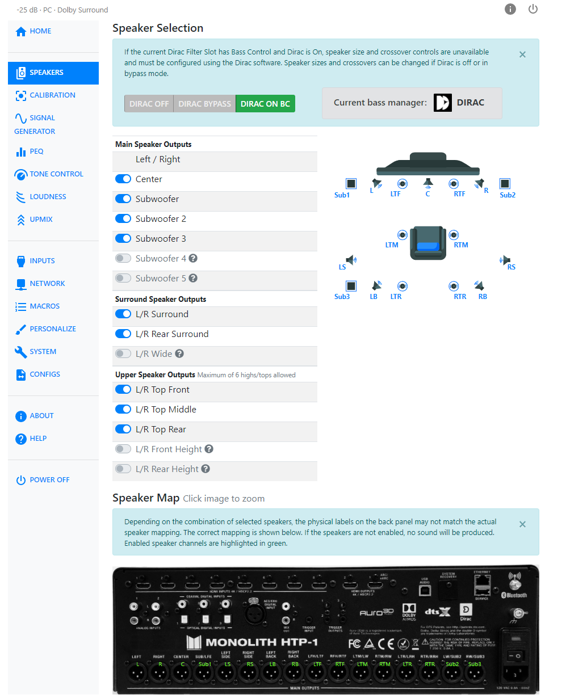
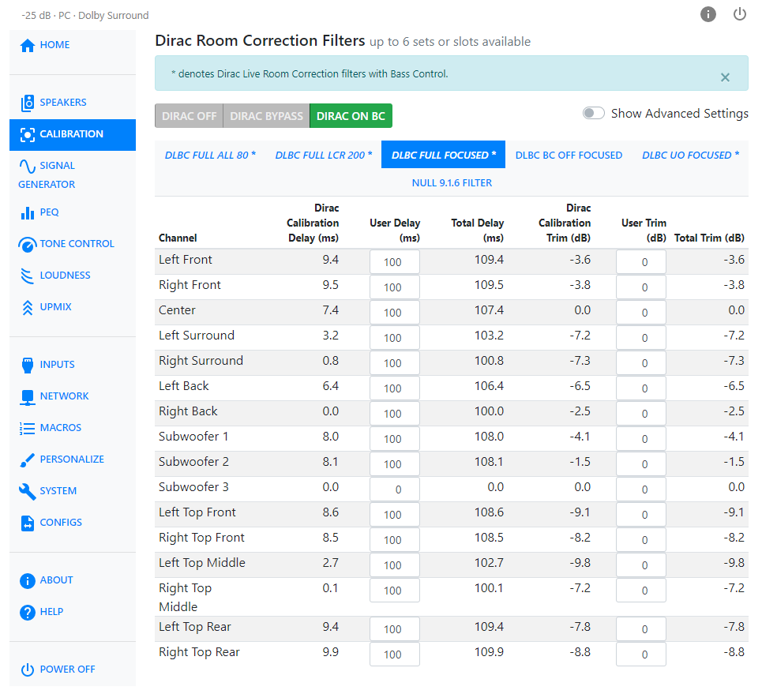
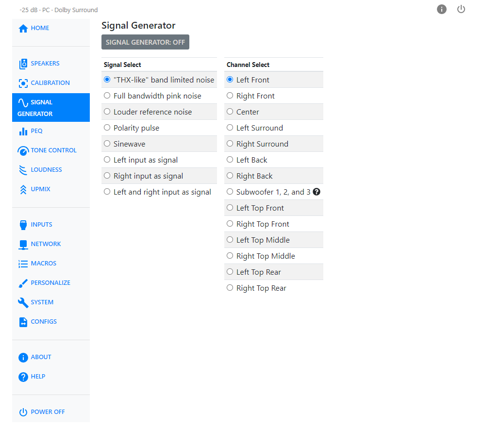
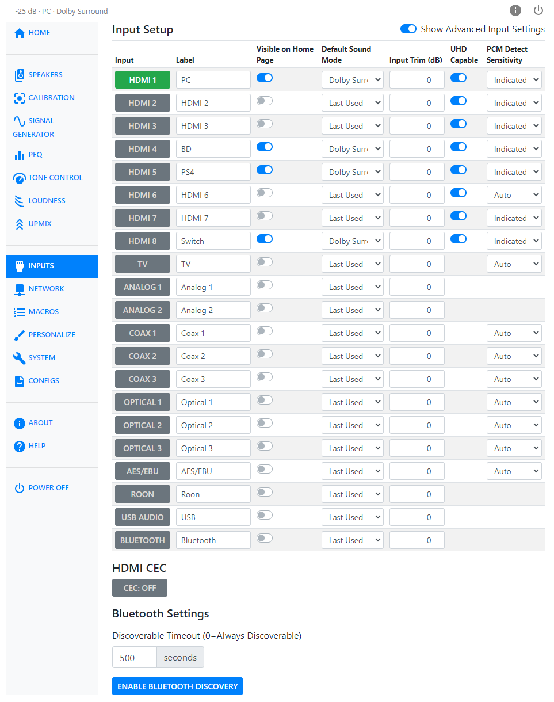
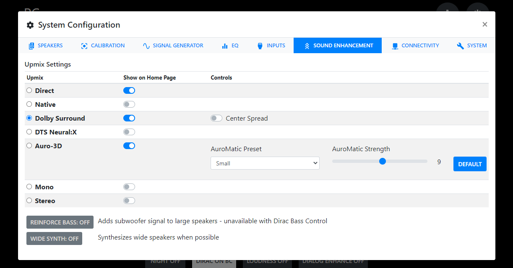

# htp1-custom-controller

## Overview
This project is an unofficial web interface to control the Monoprice Monolith HTP-1 written in Vue 3. The goal is a lightweight, responsive, and mobile-friendly interface. 

## Screens










## Project setup
```
npm install
```

### Compiles and hot-reloads for development
```
npm run serve
```

### Compiles and minifies for production
```
npm run build
```

### Building and Uploading to HTP-1
1. With the latest NodeJS LTS installed on your machine, check out the code and run the following:
```
npm install
npm run build
```
2. This compiles and minifies the project to the `dist` directory. Rename `dist` to `custom`.
3. Upload the `custom` directory to `/opt/olympia/node-red/static` on the HTP-1, removing the old `custom` directory first, if it already exists on the HTP-1.
4. The custom controller can be accessed at `http://{Your HTP-1 IP address}/custom/`.


### Customize configuration
See [Configuration Reference](https://cli.vuejs.org/config/).
